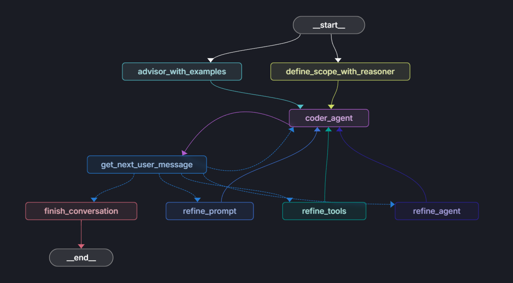

# Archon V6 - Tool Library and MCP Integration

This is the sixth iteration of the Archon project, building upon V5 by implementing a comprehensive library of prebuilt tools, examples, and MCP server integrations. The system retains the multi-agent coding workflow with specialized refiner agents from V5, but now adds a powerful advisor agent that can recommend and incorporate prebuilt components.

What makes V6 special is its approach to reducing development time and hallucinations through component reuse. The advisor agent can now analyze the user's requirements and recommend relevant prebuilt tools, examples, and MCP server integrations from the agent-resources library. This significantly enhances Archon's capabilities and reduces the need to create everything from scratch.

1. **Advisor Agent**: Recommends relevant prebuilt tools, examples, and MCP servers
2. **Tools Refiner Agent**: Now also validates and optimizes MCP server configurations
3. **Prebuilt Components Library**: Growing collection of reusable agent components

The core remains an intelligent multi-agent system built using Pydantic AI, LangGraph, and Supabase, but now with access to a library of prebuilt components that can be incorporated into new agents.

## Key Features

- **Prebuilt Tools Library**: Collection of ready-to-use tools for common agent tasks
- **Example Agents**: Reference implementations that can be adapted for new agents
- **MCP Server Integrations**: Preconfigured connections to various external services
- **Advisor Agent**: Recommends relevant prebuilt components based on requirements
- **Enhanced Tools Refiner**: Validates and optimizes MCP server configurations
- **Component Reuse**: Significantly reduces development time and hallucinations
- **Multi-Agent Workflow**: Retains the specialized refiner agents from V5
- **Streamlined External Access**: Easy integration with various services through MCP

## Architecture

The V6 architecture enhances the V5 workflow with prebuilt component integration:

1. **Initial Request**: User describes the AI agent they want to create
2. **Scope Definition**: Reasoner LLM creates a high-level scope for the agent
3. **Component Recommendation**: Advisor agent analyzes requirements and recommends relevant prebuilt components
4. **Initial Agent Creation**: Primary coding agent creates a cohesive initial agent, incorporating recommended components
5. **User Interaction**: User can provide feedback or request refinement
6. **Specialized Refinement**: When "refine" is requested, three specialized agents work in parallel:
   - Prompt Refiner Agent optimizes the system prompt
   - Tools Refiner Agent improves the agent's tools and validates MCP configurations
   - Agent Refiner Agent enhances the agent configuration
7. **Integrated Improvements**: Primary coding agent incorporates all refinements
8. **Iterative Process**: Steps 5-7 repeat until the user is satisfied
9. **Finalization**: Archon provides the complete code with execution instructions

### Agent Graph

The LangGraph workflow orchestrates the entire process:



The graph shows how control flows between different agents and how the advisor agent now contributes to the initial agent creation process.

## Prebuilt Components

### Agent-Resources Library
- Located in the `agent-resources` directory at the project root
- Organized into three main categories:
  - `examples/`: Complete agent implementations that can be adapted
  - `tools/`: Individual tools for specific tasks
  - `mcps/`: Configuration files for MCP server integrations

### MCP Server Integrations
- Preconfigured connections to various external services
- JSON configuration files that define server capabilities
- Includes integrations for:
  - Brave Search
  - GitHub
  - File System
  - Git
  - And many more

### Example Agents
- Complete agent implementations that can be used as templates
- Includes examples for:
  - GitHub integration
  - MCP server usage
  - Web search functionality

### Prebuilt Tools
- Ready-to-use tools for common agent tasks
- Includes tools for:
  - GitHub file access
  - Web search
  - And more

## Using the Prebuilt Components

To leverage the prebuilt components in V6:

1. Start a conversation with Archon and describe the agent you want to create
2. Archon will automatically analyze your requirements through the advisor agent
3. Relevant prebuilt components will be recommended and incorporated into your agent
4. You can request refinement to further optimize the agent
5. The tools refiner agent will validate and optimize any MCP server configurations
6. When satisfied, ask Archon to finalize the agent

## Core Files

### Advisor Components
- `archon/advisor_agent.py`: Agent that recommends relevant prebuilt components
- `archon/agent-resources/`: Directory containing prebuilt tools, examples, and MCP configurations

### Refiner Agents
- `archon/refiner_agents/tools_refiner_agent.py`: Enhanced to validate MCP configurations

### Workflow Orchestration
- `archon/archon_graph.py`: Updated LangGraph workflow with advisor integration

## Contributing

Contributions are welcome! The prebuilt component library is just starting out, so please feel free to contribute examples, MCP servers, and prebuilt tools by submitting a Pull Request.

## Prerequisites
- Docker (optional but preferred)
- Python 3.11+
- Supabase account (for vector database)
- OpenAI/Anthropic/OpenRouter API key or Ollama for local LLMs

## Installation

### Option 1: Docker (Recommended)
1. Clone the repository:
```bash
git clone https://github.com/coleam00/archon.git
cd archon
```

2. Run the Docker setup script:
```bash
# This will build both containers and start Archon
python run_docker.py
```

3. Access the Streamlit UI at http://localhost:8501.

### Option 2: Local Python Installation
1. Clone the repository:
```bash
git clone https://github.com/coleam00/archon.git
cd archon
```

2. Install dependencies:
```bash
python -m venv venv
source venv/bin/activate  # On Windows: venv\Scripts\activate
pip install -r requirements.txt
```

3. Start the Streamlit UI:
```bash
streamlit run streamlit_ui.py
```

4. Access the Streamlit UI at http://localhost:8501.
